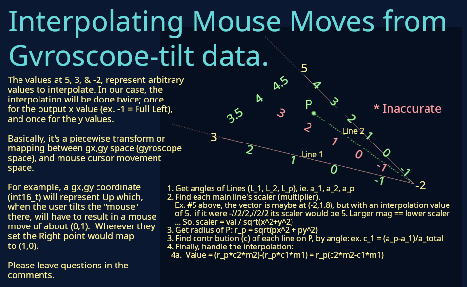

## Interpolate from two sensor values (gyrox,gyroy) into mouse (x,y) space.
by jaggz.h who is at gmail.com, 2020-09-28

See: [Youtube Demo](https://www.youtube.com/watch?v=sYNi_wDB9Zw)

## Background
Allows arbitrary positions to be set by a user with accessibility issues,
whereby they choose the positions they desire for Up, Down, Left, Right,
and Center (rest).

The interpolation then is effectively a mapping or piecewise transform
from those positions into mouse movement values.

## Caveats
* Currently the calls to the on-screen preview use Linux.  The interpolation code is not actually dependent on this, but for now main.c utilizes it so this probably won't build in, say, Windows.  I make calls to ioctl(), tcgetattr(), etc.  Stripping out use of termstuff.c and .h would get rid of that dependency.
* Please ignore that main.c is not .cpp
* The classes will end up being moved out of main.c
* This code does not deal with the sensors, which is a different project (an Arduino .ino project).  This was just to develop the mapping/interpolation library.

## Running
* Type make.  It should just run (in Linux)

## Using in your own project
* Copy radterpolate.cpp and .h to your project folder, for now.
* See main.cpp for example use
